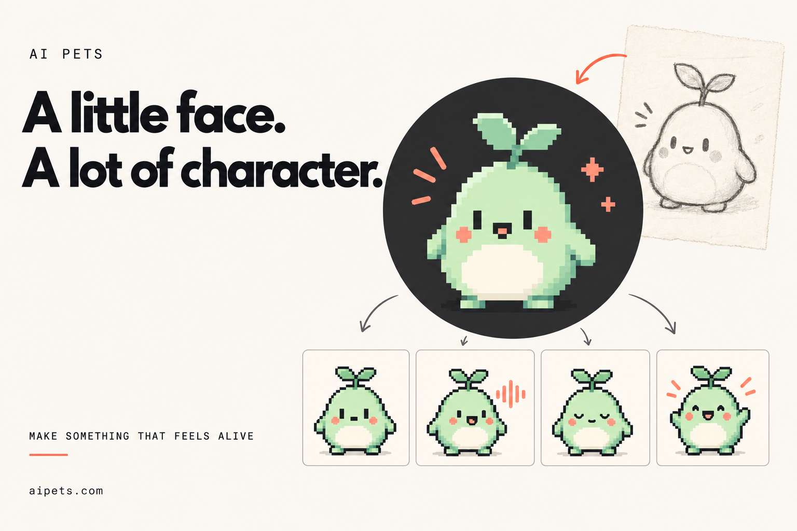
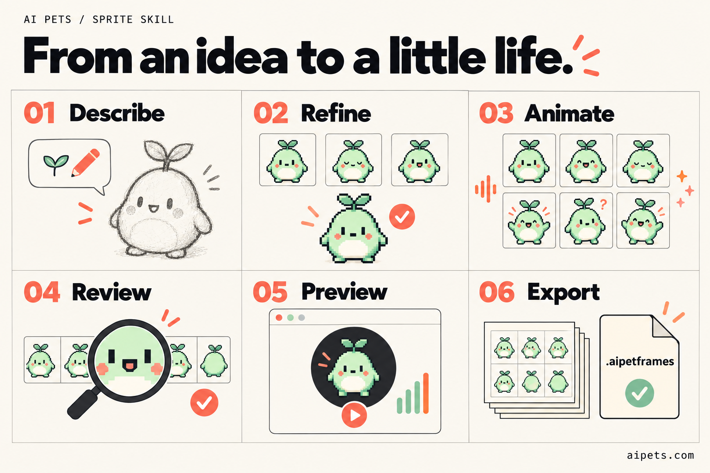
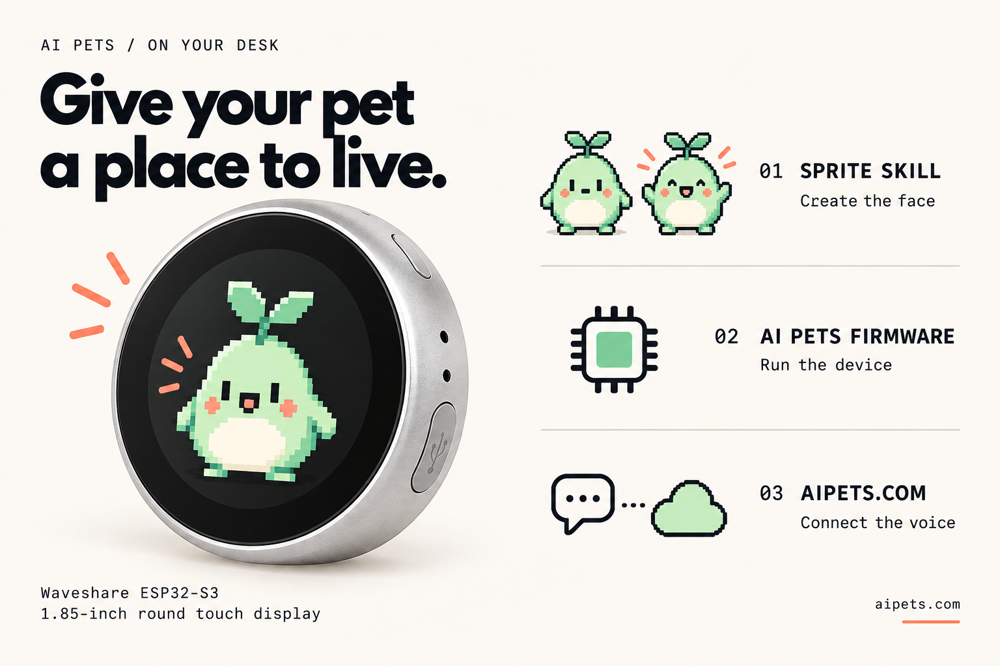

# AI Pets Sprite Skill for Codex

**Describe a little character. Give it a whole range of expressions. Make it your own.**

A [Codex](https://developers.openai.com/codex/skills/) skill from
[AI Pets](https://aipets.com/) that turns a character idea into a reviewed,
240 × 240 animation pack using built-in ImageGen. Start with a face you love,
then build the speech, blinks, glances, reactions, and small surprises that
give it character.

Put that face on a small ESP32-S3 voice companion with compatible AI Pets
firmware and the connected experience at [aipets.com](https://aipets.com/).
[See the device and how the pieces fit together.](#give-your-pet-a-place-to-live)

**[Explore AI Pets](https://aipets.com/) · [Meet the pets](https://aipets.com/directory) · [Read the field guide](https://aipets.com/learn)**

[](https://aipets.com/)

## From an idea to a little life

[](https://aipets.com/)

1. **Describe.** Tell Codex what kind of pet you imagine: its shape, colors,
   mood, and little quirks. Choose a background that makes it stand out.
2. **Refine.** See a neutral concept at pet size. Change what you like, then
   approve the look before animation begins.
3. **Animate.** Build complete speaking frames, blinks and glances, expressive
   performances, and transparent effects from the chosen character.
4. **Review.** Inspect the frames for a consistent face, readable mouth shapes,
   clean edges, and smooth returns to neutral. Keep rejected attempts and repair
   the parts that need work.
5. **Preview.** Try the compiled character in the browser player. Exercise speech,
   silence, touch, state changes, and reduced motion.
6. **Export.** Receive a portable `.aipetframes` pack, the preview, editable
   sources, and review records tied to the exact build.

*These original AI-generated illustrations explain the process. They are not
runtime screenshots or an included, production-ready pet pack.*

## Start with one prompt

After [installation](#install), open Codex in a folder for your new pet:

```text
Use $sprite-aipets to make a tiny mint-green garden spirit with
coral cheeks and a two-leaf sprout. Give it a warm cream background.
It is curious, a little clumsy, and delighted by small things.
Show me its neutral look first.
```

Refine it in chat: “Smaller cheeks.” “More sleepy than mischievous.”
“Keep that face, but make the leaves rounder.”

When the look feels right, you can authorize the rest:

```text
Use this look. Finish the required animations, speaking poses,
effects, review, and package autonomously. Keep the approved face.
```

You can also work through the stages together. The skill keeps a resumable
production record, so an unfinished pet can be continued without starting over.
If a family still fails after three attempts, it asks about the unresolved
art decision.

## Small canvas, expressive character

| Part | What it adds |
| --- | --- |
| **Speech** | Eight mouth stages by default, with complete character frames for each opening. |
| **Gaze and blinks** | Fourteen speaking poses and seven gestures, with independent mouth and pose timing. Glances and blinks have randomized 2–5-second breaks. |
| **Everyday presence** | Idle, listening, thinking, and touch reactions, with calm breathing and blink pauses. |
| **Personality** | Five distinct moments: joy, goofy, spacing out, sweet, and a signature trick that belongs to your character. |
| **State effects** | Animated transparent overlays for operational feedback, reviewed over the pet so its eyes and mouth stay readable. |

That is **112 full speaking frames at the default eight stages**.
Seven-stage sets are also supported, using 98 frames. Optional turns and extra
tricks can be considered after the required core fits the pack budget.

## Give your pet a place to live

[](https://aipets.com/learn/build-an-esp32-ai-pet)

The AI Pets hardware target is the **Waveshare ESP32-S3-Touch-LCD-1.85B**:
a small round aluminum puck with a **1.85-inch touch display** (about 4.7 cm)
and **360 × 360 physical pixels**. It has Wi-Fi, USB-C, dual microphones, and
an audio codec with speaker connection pads. Check the chosen kit for its speaker
and battery. See [Waveshare's board specifications](https://docs.waveshare.com/ESP32-S3-Touch-LCD-1.85B).

The sprite skill creates your character's **face and animations**. Compatible
**AI Pets firmware** plays the pack and handles the device's display, touch,
audio, and network connection. **[aipets.com](https://aipets.com/)** connects the
device to its configured cloud voice experience. Together, they turn a character
you designed into a little voice companion.

The speech and language services run through the connected system; they are
not large models running on the ESP32 itself. The skill's 240 × 240 artwork
resolution is separate from the board's 360 × 360 display resolution.

You can create and preview artwork before owning hardware or connecting an
AI Pets account. To use it on a device, you need a compatible firmware release,
pack installation, and device enrollment. Follow the
[AI Pets builder's guide](https://aipets.com/learn/build-an-esp32-ai-pet) and
[current access information](https://aipets.com/) for that next step.

*Illustrative device mockup based on the Waveshare enclosure. The character
shown is a concept, not a photograph of a tested installation.*

## Install

**You need:** Codex with built-in ImageGen access, plus Node.js 22 or newer and npm.
The sprite workflow uses Codex's image-generation access; it does not require
a separate generation API key, an H3 account, or a private repository.
Your Codex usage limits still apply.

1. [Download the latest skill ZIP](https://github.com/veiovi/aipets-sprite-skill/releases/latest/download/sprite-aipets-codex.zip).
   Extract its complete `sprite-aipets` folder into
   your Codex skills directory, normally `~/.codex/skills/`. Keep its
   `scripts/compiler.tgz` and all supporting files.
2. Set up the bundled compiler:

   ```sh
   node ~/.codex/skills/sprite-aipets/scripts/setup.mjs
   ```

   Setup verifies the compiler and installs pinned dependencies from npm's
   public registry with dependency lifecycle scripts disabled.
3. Reload skills or restart Codex if needed. Invoke **`$sprite-aipets`**.

If you prefer Git, clone the [public skill repository](https://github.com/veiovi/aipets-sprite-skill)
into that same folder, then run setup:

```sh
git clone https://github.com/veiovi/aipets-sprite-skill.git ~/.codex/skills/sprite-aipets
node ~/.codex/skills/sprite-aipets/scripts/setup.mjs
```

Use either the ZIP or Git method. Keep an existing installation until you have
reviewed how to update it.

The display name is **AI Pets Sprite Skill for Codex**; the skill command and
folder name remain `sprite-aipets`.

## What you take away

- **A portable `.aipetframes` asset pack** for a compatible AI Pet runtime.
- **A browser preview** using the bundled canonical C/WASM player, with local
  speech-file and microphone input. Preview audio stays local.
- **Editable artwork and production records:** source sheets, prompts,
  selections, rejected attempts, and progress checkpoints.
- **Build and review evidence:** source and pack hashes, compiler provenance,
  and checks for the exact delivered version.

## Built to be checked

The workflow reviews original artwork, normalized frames, transparent-effect
composites, and the compiled result. It checks that both eyes blink together,
mouth openings stay distinct, and movement stays inside the circular crop.
Visual review and technical validation are separate requirements.

The compiler checks dimensions, hashes, palette fidelity, pack size, repeatable
output, and agreement between the C/WASM player and TypeScript reference.
Delivery rejects stale review evidence and failed gates.

<details>
<summary><strong>Working on the pipeline?</strong></summary>

Read the [skill instructions](SKILL.md), [workflow and commands](references/workflow.md),
[prompt recipes](references/prompts.md), [speaking-pose reference](references/speaking-poses.md),
and [expressive animation guide](references/expressive-animation.md).
The [animation standard](references/animation-standard.md) defines the shared inventory.

The production sequence is `scaffold → prepare → build → deliver`.
Build double-compiles for determinism, runs a 1,152-tick canonical state trace
and 14,400 speaking/profile/drift parity ticks, and emits review material.
Long or custom clips still need their own visual inspection.

`scripts/speaking-poses.test.mjs` is a focused configuration check.
The compiler version and hashes are recorded in
[compiler-provenance.json](compiler-provenance.json).

</details>

## Bring it to a device

The output is an **animation asset pack**. Device installation requires compatible
**240px AI Pet firmware with speaking-pose support** and verified storage capacity.
Firmware flashing, cloud identity, voice configuration, and catalog publication
are separate steps; this skill prepares the character's visual assets.

A complete pack must fit **3,000,000 bytes**, or the smaller configured device
slot or explicit budget. The required core targets 80–85% of that limit to
leave room for optional additions. The authoring limit does not increase
your device's capacity.

Microphone preview may require a permitted secure browser context.
Upgrading from `sprite-aipet`? Replace the old skill installation instead of
loading both, and follow the [speaking configuration migration](references/speaking-poses.md)
for older projects.

## Keep exploring

Made for the world of **[AI Pets](https://aipets.com/)** — small companions with
faces, voices, and personalities of their own.

- [Meet the characters](https://aipets.com/directory) for inspiration.
- [Explore the field guide](https://aipets.com/learn) to understand AI companions.
- [Read the ESP32 builder's guide](https://aipets.com/learn/build-an-esp32-ai-pet)
  for the broader hardware and voice architecture.
- [Visit aipets.com](https://aipets.com/) for current access and project updates.

## License

The skill and bundled compiler are [MIT licensed](LICENSE).
Keep the included [third-party notices](THIRD_PARTY_NOTICES.md).
The README illustrations were created for this project; their
[prompts and provenance](assets/readme/illustration-prompts.md) are included.
Private character-production artwork is not part of the skill bundle.

**[Make room for a little character → aipets.com](https://aipets.com/)**
